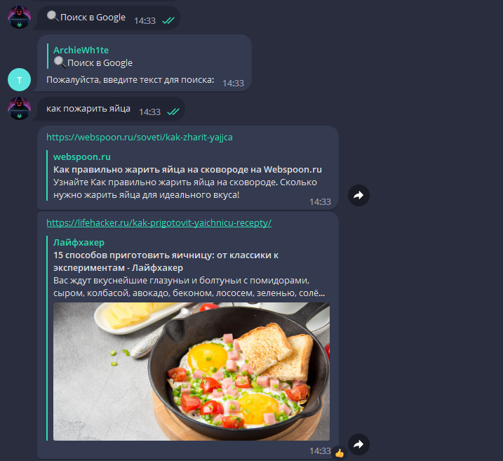
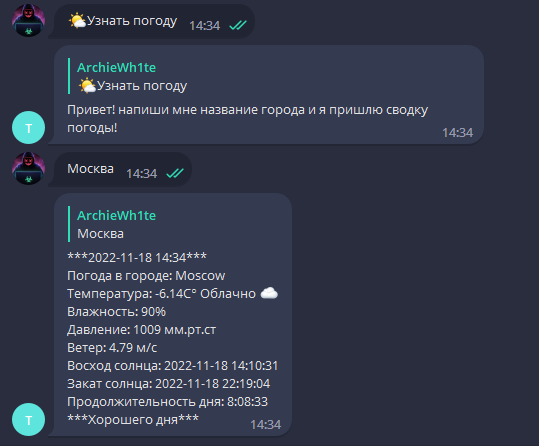

**ToolsBot v1.0**

**Author:** @ArchieWh1te

**Language:** Python 3.8+

**library pypi:** python-dotenv, aiogram, requests, folium, google 

**License:** Free

### ToolsBot с функциями

**Описание:**

Бот имеет 5 функций: Поиск в Google, Поиск в YouTube, может узнать погоду, показывает информацию об IP и может определить IP сайта.  

Бот написан на асинхронной библиотеке **aiogram** в хорошей структуре и расположении файлов.

Для того чтобы работала погода вам надо зарегистрироваться на сайте https://openweathermap.org/ и получить **ТОККЕН**, далее записать его в файл *.env* в переменную *open_weather_key* (токен должен быть в двойных кавычках " ")

Для работы бота запускаем файл *app.py*.

В папке *location* хранится спарсиный html с картой IP адреса который мы вводим у бота. 

**Скриншоты**

*Клавиатура*

*Поиск в Google(Выдаст 5 ссылок)*

*Узнать IP сайта*

*Узнать погоду*

*Поиск в YouTube(Выдаст 5 ссылок)*

